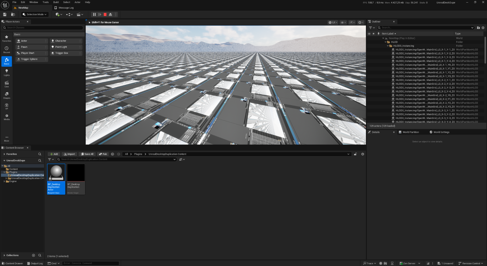

# Desktop Duplication for Unreal Engine

Exposes a desktop captured by the [Desktop Duplication API](https://learn.microsoft.com/en-us/windows/win32/direct3ddxgi/desktop-dup-api) as an Unreal texture.

## Prerequisites
* Platform: Win64
* Unreal Engine 5.6+
    * Tested with Unreal Engine 5.6.1. May or may not work with previous versions.
 
## Usage
* Clone the repository into the "Plugins" directory of your project.
* Restart Unreal Engine and check the plugin list for "UnrealDesktopDuplication".
* The [`UDesktopDuplicator`](Source/UnrealDesktopDuplication/Public/DesktopDuplicator.h) is the core class implementing all the stuff.
* The `BP_DesktopDuplicationActor` in the plugin's content shows how to put everything together. It uses the `RT_DesktopDuplication` render target next to it as its destination.
* You can create additional instances with different render targets to duplicate multiple screens. Use the `Target` property of the blueprint to set the display name you want to see, for instance "\\.\DISPLAY0". If no display is configured, the first one found will be used.
* The `Timeout` property of the blueprint will be passed to [`IDXGIOutputDuplication::AcquireNextFrame`](https://learn.microsoft.com/en-us/windows/win32/api/dxgi1_2/nf-dxgi1_2-idxgioutputduplication-acquirenextframe). A value of zero will check the availability of a new frame in a non-blocking manner. A value of -1 will block indefinitely until the next frame is available.
* The `UDesktopDuplicator` has a property named `AllowGpuCopy` which allows direct texture to texture copies if the underlying RHI is Direct3D 11. This is not exposed via the Blueprint, because I was unable to make it work reliably until now! You should not use this.
